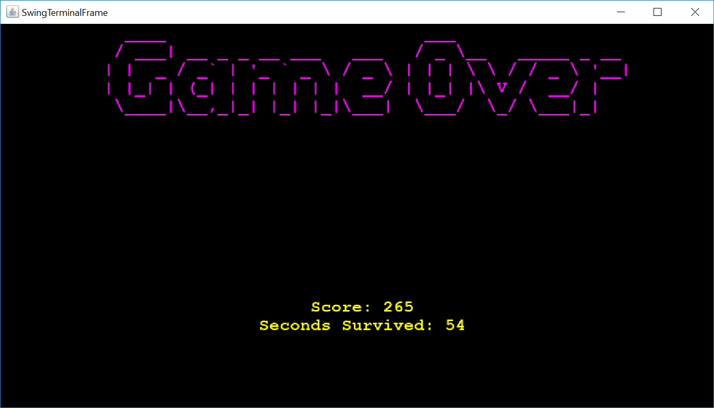

# LPOO_39 "Look, a monster! PEW PEW!"

&nbsp;&nbsp; This project was based on the game Boxhead, it consists in a shooter in which an infinite number of waves of increasingly more enemies pursue the hero decreasing its health upon each attack. The goal of the game is to survive as many waves as possible.

&nbsp;&nbsp; Project made by João Luz (up201703782@fe.up.pt) and Liliana Almeida (up201706908@fe.up.pt) for LPOO 2018/2019.

 

## Implemented Features

&nbsp;&nbsp; **Shooting** - the hero has the ability to shoots his/her enemies provided that the bullets do not run out. For each enemy killed the hero is rewarded with a certain amount of points.

&nbsp;&nbsp; **Build and destroy** - the hero is given the skill to alter his/her environment by building impenetrable walls wherever it is needed, these walls can later be destroyed.

&nbsp;&nbsp; **Collectibles** - throughout the map, there are a bunch of different items that can help the hero defeat the enemies. Each of these items has a different effect on the hero and appear in random places. All collectibles are replaced by new ones once the hero has acquired them all.

&nbsp;&nbsp; **Waves** - the hero has to defeat infinite groups of enemies that become larger every wave/round. Each enemy comes from one of the four entrances to the arena, which is chosen randomly and proceeds to pursue the hero.

&nbsp;&nbsp; **Enemy movement** - all enemies chase the hero, but they do it independently from each other, giving a sense of unpredictability to their movement.

&nbsp;&nbsp; **Hero stats** - relevant information is displayed on the top of the screen such as the score, the health of the hero, the ammo, the number of bricks and the number of waves played.

&nbsp;&nbsp; **Log screen** - in order to keep the player updated on the different events that occur, a second screen was implemented displaying a different kind of messages, from the second the game starts to the second the hero dies.

 

&nbsp;&nbsp; Illustration of some of the features:

> Game Board with hero stats, enemies, collectibles, and bricks placed by the hero.

 

>  Illustration of same features through the Swing interface.

 

> Log Screen

&nbsp;&nbsp;

 

> Log screen using the Swing interface.

 

> Game Over Screen

 

> Game Over Screen using the Swing interface.

 

## Planned Features

&nbsp;&nbsp; **Several kinds of enemies** - different enemies, with different attacks and movements.

&nbsp;&nbsp; **Information File** - a file would be used to store relevant information such as high scores obtained in other games, and different maps to play in.

&nbsp;&nbsp; **Potions** - since the game becomes progressivly harder, it would be helpful to have a collectible that would improve the hero's health. Such feature could be easily implemented since all collectibles implement the Item interface and know their effect on the hero. 

 

## Design

### THE BULLETS SHOULD BE REUSED
#### Problem in Context

&nbsp;&nbsp; Every time the user shot a bullet, a new one was created and it was removed when it collided with a wall or an enemy. Since this operation can occur a lot of times, it decreases performance.

#### The Pattern

&nbsp;&nbsp; We have applied the **Object Pool** pattern. This design pattern's goal is to avoid creating new instances of an object when they can be reused rather than eliminated, creating new objects only if the pool is empty. This problem was mainly in [fireBullet()] and [moveBullets()] functions.

#### Implementation

&nbsp;&nbsp; To fix the problem, an Array List (*availableBullets*) was created to keep the instances of bullets that were created but not in use anymore. Whenever a bullet must be created, this new instance will be the first one in the Array List (changing its position and direction) if not empty otherwise a new instance will be created. When a bullet hits a enemy or a wall, it's removed from the bullets in use and added to the array created for the instances ready to be reused.

&nbsp;&nbsp; The following figure shows how this pattern was mapped in the application classes:

&nbsp;&nbsp;

&nbsp;&nbsp; This class corresponds to the file [Map](../project/src/main/java/lpoo39/Logic/Map.java), especially the same functions [fireBullet()](../project/src/main/java/lpoo39/Logic/Map.java#L266-L283) and [moveBullets()](../project/src/main/java/lpoo39/Logic/Map.java#L234-L251).

#### Consequences  
&nbsp;&nbsp; Even though the implementation of this design pattern leads to the use of a new List of 'Bullets', which is redundant given that there already is a list storing the same type of data, it allows the reusability of an object instead of its creation and subsequent deletion, leading to a better performance given the large number of bullets that can be created.

 

### NEW INTERFACES
#### Problem in Context

&nbsp;&nbsp; Initially, the game was designed to be played using only the **Lanterna** interface, making it hard to implement new interfaces. Even if the requirement of implementing the **Swing** interface was met, the addition of new interfaces would be equally hard each time, given the necessity of large structural changes.

#### The Pattern

&nbsp;&nbsp; To avoid such significant changes in the code's structure, we implemented the **Abstract Factory** design pattern. The goal of this design pattern is to instantiate groups of related products, in this case, visual representations of each game element, without the use of concrete classes.

#### Implementation

&nbsp;&nbsp; In order to avoid using specific classes responsible for the View methods, we created two interfaces: (*DrawingGraphic*) (an interface for the factories) and (*DrawingElement*) (an interface for the classes responsible for the "draw" methods of each element). Both factories, (*LanternaFactory*) and (*SwingFactory*), implement the (*DrawingGraphic*) interface, producing (*DrawingElement*) such as (*HeroSwing*) or (*HeroLanterna*), depending on the factory.   

&nbsp;&nbsp; The following figure shows how this pattern was mapped in the application classes:

&nbsp;&nbsp;

&nbsp;&nbsp; The interfaces mentioned are [DrawingGraphic](../project/src/main/java/lpoo39/Draw/DrawingGraphic.java), [DrawingElement](../project/src/main/java/lpoo39/Draw/DrawingElement.java) and the most relevant classes are [SwingFactory](../project/src/main/java/lpoo39/Draw/Swing/SwingFactory.java) and [LanternaFactory](../project/src/main/java/lpoo39/Draw/Lanterna/LanternaFactory.java).

#### Consequences  
&nbsp;&nbsp; Using this design pattern, we are able to obtain the right object for each element, depending on the chosen interface.
This implementation also respects the Open/Closed Principle since it makes it possible to implement new interfaces without changing the existing code. 

 

### ONE AND ONLY ONE GAME
#### Problem in Context

&nbsp;&nbsp; When implementing the Abstract Factory, classes that needed to know how to draw themselves also needed to know which factory was being implemented in order to draw.

#### The Pattern

&nbsp;&nbsp; The pattern used for this problem was **Singleton** that ensures that exists only and only one instance of a class, while all other classes can access to that instance when it's already created.

#### Implementation

&nbsp;&nbsp; To implement this pattern, we added the static attribute [game_inst], innitialy null, and used the [getInstance()] method that assures only one instance is made. 

&nbsp;&nbsp; The following figure shows how this pattern was mapped in the application classes:

&nbsp;&nbsp;

&nbsp;&nbsp; The most relevant class is the [Game](../project/src/main/java/lpoo39/Logic/Game.java) class and its method [getInstance()].

#### Consequences  
&nbsp;&nbsp; By using this design pattern, we are able to access one and only instance of the Game class and its attributes, allowing all classes that need to draw themselves to know which factory is the one being used and access it.
 

## Known Code Smells and Refactoring Suggestions

### Speculative Generality
&nbsp;&nbsp; The fields *health* and *attack* of [Enemy](../project/src/main/java/lpoo39/Logic/Enemy.java) and [Hero](../project/src/main/java/lpoo39/Logic/Hero.java) classes, respectively, that are in the superclass [Character](../project/src/main/java/lpoo39/Logic/Character.java), are not used in any part of the project since they were made to have more than one kind of enemies but that's a feature not yet implemented. If not implemented, the code smell can be fixed by deleting the Character class and the respective field in Enemy and Hero class.

### Duplicate Code
&nbsp;&nbsp; The switch statement in [destroyBrick()](../project/src/main/java/lpoo39/Logic/Map.java#L197-L232) and [buildBrick()](../project/src/main/java/lpoo39/Logic/Map.java#L286-L324) in [Map Class](../project/src/main/java/lpoo39/Logic/Map.java) is duplicated so they do exactly the same thing. It is used to get the next position of the hero according to the direction given. This duplication is unnecessary because a unique switch statement can be used by both, extracting it to a new Method which can be in the Map Class or moved to the [Hero Class](../project/src/main/java/lpoo39/Logic//Hero.java) since it's related to it.

### Speculative Generality
&nbsp;&nbsp; .

 

## Testing Results

&nbsp;&nbsp; A lot of tests were made to test extensively our code. The coverage can be seen in [tests](../project/build/reports/coverage/index.html) and the following images show its results:

&nbsp;&nbsp;

&nbsp;&nbsp;

&nbsp;&nbsp;

 

&nbsp;&nbsp; It's also possible too check the tests quality with the mutation testing report, that is in [mutation](../project/build/reports/pitest/201906022356/index.html). The results are the following:

&nbsp;&nbsp;

&nbsp;&nbsp;

&nbsp;&nbsp;

&nbsp;&nbsp; It should be noted that most of the not covered tests are related to the view of the game and it's hard to test it.

 

## Self-evaluation

&nbsp;&nbsp; The project tasks were evenly distributed by participants:

&nbsp;&nbsp; Liliana Almeida: **50%** 
&nbsp;&nbsp;&nbsp;&nbsp;&nbsp;&nbsp; João Luz : **50%**

[game_inst]: ../project/src/main/java/lpoo39/Logic/Game.java#L14

[getInstance()]: ../project/src/main/java/lpoo39/Logic/Game.java#L23-L28

[moveBullets()]: https://github.com/FEUP-LPOO/projecto-lpoo-2019-lpoo_39/blob/581430101fbbeefff948469e15886484ddc2728c/project/src/main/java/Map.java#L253-L268

[fireBullet()]: https://github.com/FEUP-LPOO/projecto-lpoo-2019-lpoo_39/blob/581430101fbbeefff948469e15886484ddc2728c/project/src/main/java/Map.java#L272-L281

